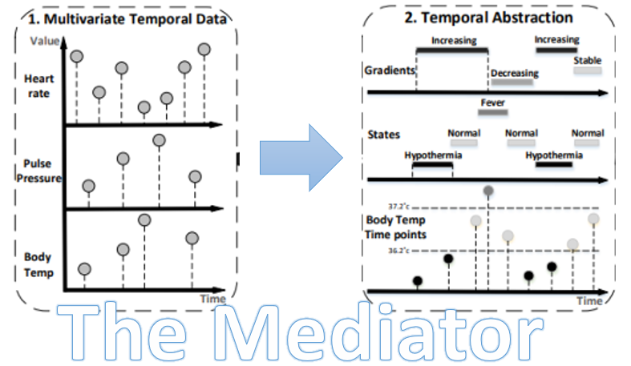

# Mediator — Knowledge-Based Temporal Abstraction

<p align="center">
  
</p>

## Overview

The **Mediator** is a Python-based implementation of Knowledge-Based Temporal Abstraction (KBTA) that converts time-stamped clinical data into interval-based symbolic abstractions for research and predictive modeling.

**Key Features:**
- ✅ **Hierarchical abstractions** — Raw Concepts → Events → States → Trends → Contexts → Patterns
- ✅ **XSD schema validation** — Structural validation for all TAK definitions
- ✅ **Production-ready** — SQLite backend, async processing, comprehensive tests
- ✅ **Extensible** — XML-based TAK definitions (no code changes needed)

**Theoretical Foundation:**

This implementation is based on the KBTA framework:

1. **Shahar, Y., & Musen, M. A. (1996).** "Knowledge-based temporal abstraction in clinical domains." *Artificial Intelligence in Medicine*, 8(3), 267-298.
   - DOI: [10.1016/0933-3657(95)00036-4](https://doi.org/10.1016/0933-3657(95)00036-4)

2. **Shalom, E., Goldstein, A., Weiss, R., Selivanova, M., Cohen, N. M., & Shahar, Y. (2024).** "Implementation and evaluation of a system for assessment of the quality of long-term management of patients at a geriatric hospital." *Journal of Biomedical Informatics*, 156, 104686.
   - DOI: [10.1016/j.jbi.2024.104686](https://doi.org/10.1016/j.jbi.2024.104686)

---

## Repository Structure

```
Mediator/
├── backend/                                # Database layer
│   ├── data/
│   │   ├── generate_synthetic_data.ipynb   # Synthetic data generator
│   │   ├── mediator.db                     # SQLite database (auto-created)
│   │   └── synthetic_input_data.csv        # Example input CSV
│   ├── queries/                            # SQL templates (DDL, DML, SELECT)
│   ├── config.py                           # Database paths
│   └── dataaccess.py                       # Database access + CLI
├── core/                                   # TAK engine
│   ├── knowledge-base/                     # TAK definitions (XML)
│   │   ├── raw-concepts/                   # Single/multi-attribute concepts
│   │   ├── events/                         # Point-in-time events
│   │   ├── states/                         # Interval-based states
│   │   ├── trends/                         # Slope-based trends
│   │   ├── contexts/                       # Background contexts
│   │   ├── patterns/                       # Temporal patterns (TODO)
│   │   ├── global_clippers.json            # Global START/END clippers
│   │   ├── tak_schema.xsd                  # XSD validation schema
│   │   └── TAK_README.md                   # TAK documentation
│   ├── tak/                                # TAK implementation
│   │   ├── tak.py                          # Base classes + repository
│   │   ├── raw_concept.py                  # RawConcept TAK
│   │   ├── event.py                        # Event TAK
│   │   ├── state.py                        # State TAK
│   │   ├── trend.py                        # Trend TAK
│   │   ├── context.py                      # Context TAK
│   │   ├── pattern.py                      # Pattern TAK (TODO)
│   │   └── utils.py                        # Shared utilities
│   ├── config.py                           # TAK paths
│   └── mediator.py                         # Orchestration engine + CLI
├── images/                                 # Documentation assets
├── unittests/                              # Comprehensive test suite
├── setup.py                                # Package definition (for pip install -e)
├── Dockerfile                              # Docker image definition
├── docker-compose.yml                      # Docker Compose configuration
├── .dockerignore                           # Files excluded from Docker build
├── MANIFEST.in                             # Package data files
├── requirements.txt                        # Python dependencies
├── LICENSE                                 # MIT License
└── README.md                               # This file
```

---

## Deployment Options

**Choose the deployment method that fits your use case:**

| **Scenario** | **Recommended Method** | **Section** |
|--------------|------------------------|-------------|
| 💻 **Local development (IDE)** | [**Option 1**](#option-1-local-development-ide) | Code editing, testing, CLI debugging |
| 📊 **Research workflows (Jupyter)** | [**Option 2**](#option-2-jupyter-notebook-package) | Interactive analysis, Python API |
| 🐳 **Remote/Production (Docker)** | [**Option 3**](#option-3-docker-deployment) | Reproducible, isolated, Python 3.7 compatible |

---

## Option 1: Local Development (IDE)

**Best for:** Code editing, testing, debugging, TAK development with full IDE support

### Requirements
- Python 3.9+ (check: `python3 --version`)
- IDE (VS Code, PyCharm, etc.)
- Git

---

### 1.1 Package & Deploy

```bash
# Clone repository
git clone https://github.com/shaharoded/Mediator.git
cd Mediator

# Create virtual environment
python3 -m venv .venv
source .venv/bin/activate  # Windows: .venv\Scripts\activate

# Install dependencies
pip install --upgrade pip
pip install -r requirements.txt

# Install as editable package (enables imports from anywhere)
pip install -e .
```

---

### 1.2 Load in Target Machine

**If deploying to a different machine:**

```bash
# Option A: Git clone (recommended)
git clone https://github.com/YOUR_USERNAME/Mediator.git
cd Mediator
python3 -m venv .venv && source .venv/bin/activate
pip install -r requirements.txt && pip install -e .

# Option B: Transfer ZIP archive
# LOCAL:
zip -r mediator-src.zip . -x "*.pyc" "__pycache__/*" ".venv/*" ".git/*" "*.db" "*.log"
scp mediator-src.zip user@remote-server:/home/user/

# REMOTE:
ssh user@remote-server
cd /home/user/
unzip mediator-src.zip
cd Mediator/
python3 -m venv .venv && source .venv/bin/activate
pip install -r requirements.txt && pip install -e .
```

---

### 1.3 Initialize Database & Load CSV

**Create database tables:**
```bash
python -m backend.dataaccess --create_db
```

**Load CSV (Option A: Place in `backend/data/`):**
```bash
# Copy your CSV to data folder
cp /path/to/your/input_data.csv backend/data/

# Load into database
python -m backend.dataaccess --load_csv backend/data/input_data.csv --yes
```

**Load CSV (Option B: Pass absolute path):**
```bash
# Load from any location
python -m backend.dataaccess --load_csv /absolute/path/to/input_data.csv --yes
```

**CSV Requirements:**
- **Required columns:** `PatientId`, `ConceptName`, `StartDateTime`, `EndDateTime`, `Value`
- **Optional columns:** `Unit`
- **Format:** `YYYY-MM-DD HH:MM:SS` timestamps

---

### 1.4 Upload New TAKs

**Extract TAK ZIP to knowledge-base folder:**
```bash
# Extract new TAKs (maintains folder structure)
unzip new_taks.zip -d core/knowledge-base/

# Verify extraction
ls core/knowledge-base/raw-concepts/
ls core/knowledge-base/states/

# Validate all TAKs against schema
find core/knowledge-base -name "*.xml" -exec \
    xmllint --schema core/knowledge-base/tak_schema.xsd {} \;
```

---

### 1.5 Run Mediator (CLI)

**Process all patients:**
```bash
python -m core.mediator
```

**Process specific patients:**
```bash
python -m core.mediator --patients 1000,1001,1002
```

**Debug mode:**
```bash
python -m core.mediator --patients 1000 --log-level DEBUG
```

**Custom settings:**
```bash
python -m core.mediator \
    --kb core/knowledge-base \
    --db backend/data/mediator.db \
    --max-concurrent 8 \
    --log-level INFO
```

---

### 1.6 Run Tests

```bash
# Run all tests (53 tests)
python -m pytest unittests/ -v

# Run specific test modules
python -m pytest unittests/test_raw_concept.py -v
python -m pytest unittests/test_event.py -v
python -m pytest unittests/test_state.py -v
python -m pytest unittests/test_trend.py -v
python -m pytest unittests/test_context.py -v
python -m pytest unittests/test_mediator.py -v

# With coverage report
python -m pytest unittests/ --cov=core --cov=backend --cov-report=html
```

---

## Option 2: Jupyter Notebook (Package)

**Best for:** Research workflows, interactive analysis, visualization, Python API usage

### Requirements
- Python 3.9+
- Jupyter Notebook

---

### 2.1 Package & Deploy

```bash
# Clone repository
git clone https://github.com/shaharoded/Mediator.git
cd Mediator

# Create virtual environment
python3 -m venv .venv
source .venv/bin/activate

# Install package + Jupyter
pip install --upgrade pip
pip install -r requirements.txt
pip install -e .
pip install jupyter notebook
```

---

### 2.2 Load in Target Machine

**Transfer code to remote server:**
```bash
# LOCAL:
zip -r mediator-jupyter.zip . -x "*.pyc" "__pycache__/*" ".venv/*" ".git/*" "*.db"
scp mediator-jupyter.zip user@remote-server:/home/user/

# REMOTE:
ssh user@remote-server
cd /home/user/
unzip mediator-jupyter.zip
cd Mediator/
python3 -m venv .venv && source .venv/bin/activate
pip install -r requirements.txt && pip install -e . && pip install jupyter notebook
```

---

### 2.3 Initialize Database & Load CSV

**Place CSV in `backend/data/` folder:**
```bash
# Copy your CSV
cp /path/to/input_data.csv backend/data/
```

**Or use arbitrary location (reference by absolute path in notebook)**

---

### 2.4 Start Jupyter

```bash
# Activate virtual environment
source .venv/bin/activate

# Start Jupyter server
jupyter notebook

# Or specify port + disable browser
jupyter notebook --no-browser --port=8888
```

**Access from local machine (if remote):**
```bash
# SSH tunnel (on your local machine)
ssh -L 8888:localhost:8888 user@remote-server

# Open browser: http://localhost:8888
```

---

### 2.5 Create Notebook in Root

**Create new notebook: `run_mediator.ipynb` in project root**

**Cell 1: Setup**
```python
from pathlib import Path
from backend.dataaccess import DataAccess
from core.mediator import Mediator
import pandas as pd

# Paths
KB_PATH = Path("core/knowledge-base")
DB_PATH = Path("backend/data/mediator.db")
CSV_PATH = Path("backend/data/input_data_file.csv")  # Your input CSV
```

**Cell 2: Initialize Database**
```python
# Initialize connection
da = DataAccess(db_path=str(DB_PATH))

# Create tables (if not exists)
da.create_db(drop=False)  # Set drop=True to recreate tables

# Check stats
stats = da.get_table_stats()
for table, info in stats.items():
    print(f"{table}: {info['rows']} rows, {info['n_patients']} patients")
```

**Cell 3: Load CSV**
```python
# Load CSV into InputPatientData
total_rows = da.load_csv_to_input(
    csv_path=str(CSV_PATH),
    if_exists='append',           # 'append' or 'replace'
    clear_output_and_qa=False,    # Set True to clear outputs
    yes=True                      # Auto-confirm
)
print(f"Loaded {total_rows} rows")
```

**Cell 4: Build TAK Repository**
```python
# Initialize mediator
mediator = Mediator(kb_path=KB_PATH, data_access=da)

# Build TAK repository
repo = mediator.build_repository()

print(f"✅ Loaded {len(repo.taks)} TAKs:")
print(f"  - Raw Concepts: {len(mediator.raw_concepts)}")
print(f"  - Events:       {len(mediator.events)}")
print(f"  - States:       {len(mediator.states)}")
print(f"  - Trends:       {len(mediator.trends)}")
print(f"  - Contexts:     {len(mediator.contexts)}")
print(f"  - Patterns:     {len(mediator.patterns)}")

# List all TAK names
print("\nTAK Names:")
for tak_name in sorted(repo.taks.keys()):
    print(f"  - {tak_name}")
```
**Cell 5: Process Patients**
```python
# Process specific patients
patient_ids = [1000, 1001, 1002]
patient_stats = mediator.run(
    max_concurrent=4,
    patient_subset=patient_ids
)

# Print results
for pid, stats in patient_stats.items():
    if "error" in stats:
        print(f"❌ Patient {pid}: {stats['error']}")
    else:
        total = sum(v for k, v in stats.items() if isinstance(v, int))
        print(f"✅ Patient {pid}: {total} output rows")
```

**Cell 6: Query Results**
```python
# Query OutputPatientData
query = """
SELECT PatientId, ConceptName, Value, COUNT(*) as count
FROM OutputPatientData
WHERE PatientId IN (1000, 1001, 1002)
GROUP BY PatientId, ConceptName, Value
ORDER BY PatientId, count DESC
"""
df_results = pd.read_sql_query(query, da.conn)
df_results.head(20)
```

---

### 2.6 Upload New TAKs (from Notebook)

**Cell: Extract and reload TAKs**
```python
import zipfile

# Extract zipped TAKs
with zipfile.ZipFile("new_taks.zip", "r") as zip_ref:
    zip_ref.extractall("core/knowledge-base/")

print("✅ TAKs extracted")

# Rebuild repository (reloads all TAKs)
mediator = Mediator(kb_path=KB_PATH, data_access=da)
repo = mediator.build_repository()
print(f"✅ Reloaded {len(repo.taks)} TAKs")
```

---

## Option 3: Docker Deployment

**Best for:** Production servers, old Python versions (3.7), reproducible environments, cloud deployment

### Requirements
- Docker installed (check: `docker --version`)
- 2 GB free disk space

---

### 3.1 Package & Build Image

**Build from source (LOCAL machine):**

```bash
# Clone repository
git clone https://github.com/shaharoded/Mediator.git
cd Mediator

# Build Docker image
docker build -t mediator:latest .

# Save image to tar.gz (for transfer)
docker save mediator:latest | gzip > mediator-v1.0.tar.gz
```

---

### 3.2 Deploy to Target Machine

**Transfer image:**

```bash
# Transfer tar.gz to remote server
scp mediator-v1.0.tar.gz user@remote-server:/home/user/

# Or manually upload via SFTP/SCP
```

**Load image on target machine:**
```bash
# SSH to remote server
ssh user@remote-server

# Load Docker image
docker load < /home/user/mediator-v1.0.tar.gz

# Verify image loaded
docker images | grep mediator
```

---

### 3.3 Initialize Database & Load CSV

**Create data directory on host:**
```bash
# Create folder for persistent data (DB + logs)
mkdir -p /home/user/mediator_data
cd /home/user/mediator_data
```

**Create database (one-time):**
```bash
# Create database tables
docker run --rm -v $(pwd):/app/backend/data \
    mediator:latest python -m backend.dataaccess --create_db
```

**Place CSV in data folder:**
```bash
# Copy your CSV to data folder
cp /path/to/input_data_file.csv /home/user/mediator_data/
```

**Load CSV into database:**
```bash
# Load CSV from mounted data folder
docker run --rm -v /home/user/mediator_data:/app/backend/data \
    mediator:latest python -m backend.dataaccess \
    --load_csv /app/backend/data/input_data_file.csv --yes
```

**Alternative: Load CSV from arbitrary location:**
```bash
# Mount CSV from custom location
docker run --rm \
    -v /home/user/mediator_data:/app/backend/data \
    -v /custom/path/to/input.csv:/app/input.csv \
    mediator:latest python -m backend.dataaccess \
    --load_csv /app/input.csv --yes
```

---

### 3.4 Upload New TAKs

**Option A: Rebuild image with new TAKs (recommended):**
```bash
# LOCAL: Extract TAKs to knowledge-base folder
cd Mediator/
unzip new_taks.zip -d core/knowledge-base/

# Verify extraction
ls core/knowledge-base/raw-concepts/
ls core/knowledge-base/states/

# Rebuild Docker image
docker build -t mediator:v1.1 .

# Save and transfer
docker save mediator:v1.1 | gzip > mediator-v1.1.tar.gz
scp mediator-v1.1.tar.gz user@remote-server:/home/user/

# REMOTE: Load new image
ssh user@remote-server
docker load < /home/user/mediator-v1.1.tar.gz
```

**Option B: Mount TAK folder at runtime (no rebuild needed):**
```bash
# Extract TAKs on host machine (outside container)
unzip new_taks.zip -d /home/user/custom_knowledge_base/

# Verify extraction
ls /home/user/custom_knowledge_base/raw-concepts/
ls /home/user/custom_knowledge_base/states/

# Run with custom KB path
docker run --rm \
    -v /home/user/mediator_data:/app/backend/data \
    -v /home/user/custom_knowledge_base:/app/custom-kb \
    mediator:latest python -m core.mediator --kb /app/custom-kb
```

---

### 3.5 Run Mediator (Docker CLI)

**Process all patients:**
```bash
docker run --rm -v /home/user/mediator_data:/app/backend/data \
    mediator:latest python -m core.mediator
```

**Process specific patients:**
```bash
docker run --rm -v /home/user/mediator_data:/app/backend/data \
    mediator:latest python -m core.mediator --patients 1000,1001,1002
```

**Debug mode:**
```bash
docker run --rm -v /home/user/mediator_data:/app/backend/data \
    mediator:latest python -m core.mediator --patients 1000 --log-level DEBUG
```

**Custom settings:**
```bash
docker run --rm \
    -v /home/user/mediator_data:/app/backend/data \
    mediator:latest python -m core.mediator \
    --max-concurrent 8 \
    --log-level INFO
```

**Interactive shell (debugging):**
```bash
# Enter container shell
docker run --rm -it -v /home/user/mediator_data:/app/backend/data \
    mediator:latest /bin/bash

# Inside container:
python -m core.mediator --patients 1000 --log-level DEBUG
python -m pytest unittests/ -v
```

---

### 3.6 Docker Compose (Simplified)

**Alternative workflow using docker-compose:**
```bash
# Navigate to project root
cd Mediator/

# Build image
docker-compose build

# Create database
docker-compose run mediator python -m backend.dataaccess --create_db

# Load CSV
docker-compose run mediator python -m backend.dataaccess \
    --load_csv /app/backend/data/input_data_file.csv --yes

# Run pipeline
docker-compose run mediator python -m core.mediator --patients 1000,1001
```

---

### 3.7 Common Docker Workflows

**Update database with new CSV:**
```bash
# Replace existing data
docker run --rm \
    -v /home/user/mediator_data:/app/backend/data \
    -v /path/to/new_data.csv:/app/new_data.csv \
    mediator:latest python -m backend.dataaccess \
    --load_csv /app/new_data.csv --replace-input --clear-output-qa --yes
```

**Query results after processing:**
```bash
# Access database using SQLite CLI
docker run --rm -it -v /home/user/mediator_data:/app/backend/data \
    mediator:latest sqlite3 /app/backend/data/mediator.db

# Inside SQLite:
# SELECT ConceptName, COUNT(*) FROM OutputPatientData GROUP BY ConceptName;
```

**Check logs:**
```bash
# View mediator run logs
docker run --rm -v /home/user/mediator_data:/app/backend/data \
    mediator:latest cat /app/backend/data/mediator_run.log
```

---

## TAK Documentation

For detailed information about TAK families, XML schema, validation rules, and examples:

📖 **See:** [`core/knowledge-base/TAK_README.md`](core/knowledge-base/TAK_README.md)

**Quick TAK Reference:**
- **Raw Concepts** — Bridge InputPatientData → pipeline (multi-attr tuples, numeric ranges, nominal values)
- **Events** — Point-in-time occurrences (multi-source, flexible constraints)
- **States** — Interval-based symbolic states (discretization + merging)
- **Trends** — Slope-based trends (Increasing/Decreasing/Steady)
- **Contexts** — Background facts (windowing + clipping)

---

## Citation

```bibtex
@article{shahar1996knowledge,
  title={Knowledge-based temporal abstraction in clinical domains},
  author={Shahar, Yuval and Musen, Mark A},
  journal={Artificial Intelligence in Medicine},
  volume={8},
  number={3},
  pages={267--298},
  year={1996},
  publisher={Elsevier}
}

@article{shalom2024implementation,
  title={Implementation and evaluation of a system for assessment of the quality of long-term management of patients at a geriatric hospital},
  author={Shalom, Erez and Goldstein, Avraham and Weiss, Robert and Selivanova, Marina and Cohen, Nir Menachemi and Shahar, Yuval},
  journal={Journal of Biomedical Informatics},
  volume={156},
  pages={104686},
  year={2024},
  publisher={Elsevier}
}
```

---

**Maintained by:** Shahar Oded