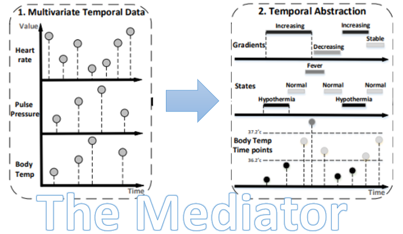

# Mediator — Knowledge-Based Temporal Abstraction

<p align="center">
  
</p>

## Overview

The **Mediator** is a Python-based implementation of Knowledge-Based Temporal Abstraction (KBTA) that converts time-stamped clinical data into interval-based symbolic abstractions for research and predictive modeling.

**Key Features:**
- ✅ **Hierarchical abstractions** — Raw Concepts → Events → States → Trends → Contexts → Patterns
- ✅ **XSD schema validation** — Structural validation for all TAK definitions
- ✅ **Production-ready** — SQLite backend, ProcessPool processing, comprehensive tests
- ✅ **Extensible** — XML-based TAK definitions (no code changes needed)

**Theoretical Foundation:**

This implementation is based on the KBTA framework:

1. **Shahar, Y., & Musen, M. A. (1996).** "Knowledge-based temporal abstraction in clinical domains." *Artificial Intelligence in Medicine*, 8(3), 267-298.
   - DOI: [10.1016/0933-3657(95)00036-4](https://doi.org/10.1016/0933-3657(95)00036-4)

2. **Shalom, E., Goldstein, A., Weiss, R., Selivanova, M., Cohen, N. M., & Shahar, Y. (2024).** "Implementation and evaluation of a system for assessment of the quality of long-term management of patients at a geriatric hospital." *Journal of Biomedical Informatics*, 156, 104686.
   - DOI: [10.1016/j.jbi.2024.104686](https://doi.org/10.1016/j.jbi.2024.104686)

---

## Repository Structure

```
Mediator/
├── backend/                                # Database layer
│   ├── data/
│   │   ├── generate_synthetic_data.ipynb   # Synthetic data generator
│   │   ├── mediator.db                     # SQLite database (auto-created)
│   │   └── input_data.csv                  # Sample input CSV (auto-created by .ipynb)
│   ├── queries/                            # SQL templates
│   ├── config.py                           # Database paths
│   └── dataaccess.py                       # Database access + CLI
├── core/                                   # TAK engine
│   ├── knowledge-base/                     # TAK definitions (XML)
│   │   ├── raw-concepts/                   # Single/multi-attribute concepts
│   │   ├── events/                         # Point-in-time events
│   │   ├── states/                         # Interval-based states
│   │   ├── trends/                         # Slope-based trends
│   │   ├── contexts/                       # Background contexts
│   │   ├── patterns/                       # Temporal patterns
│   │   ├── global_clippers.json            # Global START/END clippers
│   │   ├── tak_schema.xsd                  # XSD validation schema
│   │   └── TAK_README.md                   # TAK documentation
│   ├── tak/                                # TAK implementation
│   │   ├── tak.py                          # Base classes + tak rules
│   │   ├── repository.py                   # TAK repository object + functions
│   │   ├── raw_concept.py                  # RawConcept + ParameterizedRawConcept TAK
│   │   ├── event.py                        # Event TAK
│   │   ├── state.py                        # State TAK
│   │   ├── trend.py                        # Trend TAK
│   │   ├── context.py                      # Context TAK
│   │   ├── pattern.py                      # Pattern TAK - LocalPattern
│   │   └── utils.py                        # Shared utilities
│   ├── config.py                           # TAK paths
│   └── mediator.py                         # Orchestration engine + CLI
├── run_mediator.ipynb                      # Example flow for deployment option 2
├── images/                                 # Documentation assets
├── unittests/                              # Comprehensive test suite
├── logs/                                   # Here you'll find post-run log file.
├── setup.py                                # Package definition (for pip install -e)
├── Dockerfile                              # Docker image definition
├── docker-compose.yml                      # Docker Compose configuration
├── .dockerignore                           # Files excluded from Docker build
├── MANIFEST.in                             # Package data files
├── requirements.txt                        # Python dependencies
├── requirements-py37.txt                   # Python dependencies (for older envs)
├── LICENSE                                 # MIT License
└── README.md                               # This file
```

---

## Deployment Options

**Choose the deployment method that fits your use case:**

| **Scenario** | **Recommended Method** | **Section** |
|--------------|------------------------|-------------|
| 💻 **Local development (IDE)** | [**Option 1**](#option-1-local-development-ide) | Code editing, testing, CLI debugging |
| 📊 **Research workflows (Jupyter)** | [**Option 2**](#option-2-jupyter-notebook-package) | Interactive analysis, Python API |
| 🐳 **Remote/Production (Docker)** | [**Option 3**](#option-3-docker-deployment) | Reproducible, isolated, Python 3.7 compatible |

---

## Option 1: Local Development (IDE)

**Best for:** Code editing, testing, debugging, TAK development with full IDE support

### Requirements
- Python 3.9+ (check: `python3 --version`)
- IDE (VS Code, PyCharm, etc.)
- Git

---

### 1.1 Package & Deploy

```bash
# Clone repository

git clone https://github.com/shaharoded/Mediator.git
cd Mediator

# Create virtual environment
python3 -m venv .venv
.venv\Scripts\activate  # Windows

# Install dependencies
pip install --upgrade pip
pip install -r requirements.txt

# Install as editable package (enables imports from anywhere)
pip install -e .
```
---

### 1.2 Initialize Database & Load CSV

**Create database tables:**
```bash
python -m backend.dataaccess --create_db
```

**Load CSV (Option A: Place in `backend/data/`):**
```bash
# Copy your CSV to data folder
cp /path/to/your/input_data.csv backend/data/

# Load into database

```

**Load CSV (Option B: Pass absolute path):**
```bash
# Load from any location
python -m backend.dataaccess --load_csv /absolute/path/to/input_data.csv --yes
```

**CSV Requirements:**
- **Required columns:** `PatientId`, `ConceptName`, `StartDateTime`, `EndDateTime`, `Value`
- **Optional columns:** `Unit`
- **Format:** `YYYY-MM-DD HH:MM:SS` timestamps

---

### 1.3 Upload New TAKs

**Extract TAK ZIP to knowledge-base folder:**
```bash
# Extract new TAKs (maintains folder structure)
unzip new_taks.zip -d core/knowledge-base/

# Verify extraction
ls core/knowledge-base/raw-concepts/
ls core/knowledge-base/states/

# Validate all TAKs against schema
find core/knowledge-base -name "*.xml" -exec \
    xmllint --schema core/knowledge-base/tak_schema.xsd {} \;
```

---

### 1.4 Run Mediator (CLI)

**Process all patients:**
```bash
python -m core.mediator
```

**Process specific patients:**
```bash
python -m core.mediator --patients 1000,1001,1002
```

**Debug mode:**
```bash
python -m core.mediator --patients 1000 --log-level DEBUG
```

**Custom settings:**
```bash
python -m core.mediator \
    --kb core/knowledge-base \
    --db backend/data/mediator.db \
    --max-concurrent 8 \
    --log-level INFO
```

>> This implementation does not offer a run on a partial subset of TAKs from the repository, since it validates every TAK's dependencies before calculation, and all must be in cache when running the abstraction (it also assumes stored results from past runs might not be credible).

>> If you wish to run on a subset of TAKs you'll need to pull the desired TAKs + all of their dependencies to a new TAK folder of the same structure, and point the Mediator's config there.
---

### 1.5 Run Tests

```bash
# Run all tests
python -m pytest unittests/ -v

# Run specific test modules
python -m pytest unittests/test_raw_concept.py -v
python -m pytest unittests/test_event.py -v
python -m pytest unittests/test_state.py -v
python -m pytest unittests/test_trend.py -v
python -m pytest unittests/test_context.py -v
python -m pytest unittests/test_pattern.py -v
python -m pytest unittests/test_repository.py -v
python -m pytest unittests/test_mediator.py -v

# With coverage report
python -m pytest unittests/ --cov=core --cov=backend --cov-report=html
```

---

## Option 2: Jupyter Notebook (Package)

**Best for:** Research workflows, interactive analysis, visualization, Python API usage.
This method is designed to be deployed on an older version of python as found in my remote computer research env. The idea is to use this as a code repository with a main.ipynb file that can import and use the pythonic functions offered here.

**Note:** Python 3.7 support uses older dependency versions (pandas 1.3.5, numpy 1.21.6) which are no longer maintained. If available, Python 3.9+ is strongly recommended, and will compile with this package as well.

### Requirements
- Python 3.7+ (requirements are adapted to older version for my research env)
- Jupyter Notebook

---

### 2.1 Package & Deploy

```bash
# Clone repository
git clone https://github.com/shaharoded/Mediator.git
cd Mediator
```

---

### 2.2 Load in Target Machine

**Install 7zip if not available in your station**
```powershell-admin
winget install --id=7zip.7zip -e

And verify:

Test-Path "C:\Program Files\7-Zip\7z.exe"
```

**Package code for manual transfer:**

```powershell
# Remove existing archive if present, then create a new zip
if (Test-Path mediator-deploy.zip) { Remove-Item mediator-deploy.zip -Force }
& "C:\Program Files\7-Zip\7z.exe" a -tzip mediator-deploy.zip `
    core backend run_mediator.ipynb setup.py MANIFEST.in requirements-py37.txt README.md LICENSE `
    "-xr!backend\data\*"
```
>> If you have an old deploy file - Delete it!. This compression method merge the 2 files.
>> I used 7z for it's exclusion patterns. Other ways to do this will work as well.

---

### 2.3 Initialize Database & Load CSV

**Place CSV in `backend/data/` folder:**
```bash
# Copy your CSV
cp /path/to/input_data.csv backend/data/
```

**Or use arbitrary location (reference by absolute path in notebook)**

---

### 2.4 Start Jupyter

```bash
# Activate virtual environment
.venv\Scripts\activate  # Windows

# Start Jupyter server
jupyter notebook
```

Now navigate to `run_mediator.ipynb` and continue there.
The notebook containes pythonic usage example to use this package as an API.
In case you need to change the KB TAKs, simply keep in the KB folder only the files you want to keep / update their content etc.

---

## Option 3: Docker Deployment

**Best for:** Production servers, old Python versions (<3.7), reproducible environments, cloud deployment

### Requirements
- Docker installed (check: `docker --version`)
- 2 GB free disk space

---

### 3.1 Package & Build Image

**Build from source (LOCAL machine):**

```bash
# Clone repository
git clone https://github.com/shaharoded/Mediator.git
cd Mediator

# Build Docker image
docker build -t mediator:latest .

# Save image to tar.gz (for transfer)
docker save mediator:latest | gzip > mediator-v1.0.tar.gz
```

---

### 3.2 Deploy to Target Machine

**Transfer image:**

```bash
# Transfer tar.gz to remote server
scp mediator-v1.0.tar.gz user@remote-server:/home/user/

# Or manually upload via SFTP/SCP
```

**Load image on target machine:**
```bash
# SSH to remote server
ssh user@remote-server

# Load Docker image
docker load < /home/user/mediator-v1.0.tar.gz

# Verify image loaded
docker images | grep mediator
```

---

### 3.3 Initialize Database & Load CSV

**Create data directory on host:**
```bash
# Create folder for persistent data (DB + logs)
mkdir -p /home/user/mediator_data
cd /home/user/mediator_data
```

**Create database (one-time):**
```bash
# Create database tables
docker run --rm -v $(pwd):/app/backend/data \
    mediator:latest python -m backend.dataaccess --create_db
```

**Place CSV in data folder:**
```bash
# Copy your CSV to data folder
cp /path/to/input_data_file.csv /home/user/mediator_data/
```

**Load CSV into database:**
```bash
# Load CSV from mounted data folder
docker run --rm -v /home/user/mediator_data:/app/backend/data \
    mediator:latest python -m backend.dataaccess \
    --load_csv /app/backend/data/input_data_file.csv --yes
```

**Alternative: Load CSV from arbitrary location:**
```bash
# Mount CSV from custom location
docker run --rm \
    -v /home/user/mediator_data:/app/backend/data \
    -v /custom/path/to/input.csv:/app/input.csv \
    mediator:latest python -m backend.dataaccess \
    --load_csv /app/input.csv --yes
```

---

### 3.4 Upload New TAKs

**Option A: Rebuild image with new TAKs (recommended):**
```bash
# LOCAL: Extract TAKs to knowledge-base folder
cd Mediator/
unzip new_taks.zip -d core/knowledge-base/

# Verify extraction
ls core/knowledge-base/raw-concepts/
ls core/knowledge-base/states/

# Rebuild Docker image
docker build -t mediator:v1.1 .

# Save and transfer
docker save mediator:v1.1 | gzip > mediator-v1.1.tar.gz
scp mediator-v1.1.tar.gz user@remote-server:/home/user/

# REMOTE: Load new image
ssh user@remote-server
docker load < /home/user/mediator-v1.1.tar.gz
```

**Option B: Mount TAK folder at runtime (no rebuild needed):**
```bash
# Extract TAKs on host machine (outside container)
unzip new_taks.zip -d /home/user/custom_knowledge_base/

# Verify extraction
ls /home/user/custom_knowledge_base/raw-concepts/
ls /home/user/custom_knowledge_base/states/

# Run with custom KB path
docker run --rm \
    -v /home/user/mediator_data:/app/backend/data \
    -v /home/user/custom_knowledge_base:/app/custom-kb \
    mediator:latest python -m core.mediator --kb /app/custom-kb
```

---

### 3.5 Run Mediator (Docker CLI)

**Process all patients:**
```bash
docker run --rm -v /home/user/mediator_data:/app/backend/data \
    mediator:latest python -m core.mediator
```

**Process specific patients:**
```bash
docker run --rm -v /home/user/mediator_data:/app/backend/data \
    mediator:latest python -m core.mediator --patients 1000,1001,1002
```

**Debug mode:**
```bash
docker run --rm -v /home/user/mediator_data:/app/backend/data \
    mediator:latest python -m core.mediator --patients 1000 --log-level DEBUG
```

**Custom settings:**
```bash
docker run --rm \
    -v /home/user/mediator_data:/app/backend/data \
    mediator:latest python -m core.mediator \
    --max-concurrent 8 \
    --log-level INFO
```

**Interactive shell (debugging):**
```bash
# Enter container shell
docker run --rm -it -v /home/user/mediator_data:/app/backend/data \
    mediator:latest /bin/bash

# Inside container:
python -m core.mediator --patients 1000 --log-level DEBUG
python -m pytest unittests/ -v
```

---

### 3.6 Docker Compose (Simplified)

**Alternative workflow using docker-compose:**
```bash
# Navigate to project root
cd Mediator/

# Build image
docker-compose build

# Create database
docker-compose run mediator python -m backend.dataaccess --create_db

# Load CSV
docker-compose run mediator python -m backend.dataaccess \
    --load_csv /app/backend/data/input_data_file.csv --yes

# Run pipeline
docker-compose run mediator python -m core.mediator --patients 1000,1001
```

---

### 3.7 Common Docker Workflows

**Update database with new CSV:**
```bash
# Replace existing data
docker run --rm \
    -v /home/user/mediator_data:/app/backend/data \
    -v /path/to/new_data.csv:/app/new_data.csv \
    mediator:latest python -m backend.dataaccess \
    --load_csv /app/new_data.csv --replace-input --clear-output-qa --yes
```

**Query results after processing:**
```bash
# Access database using SQLite CLI
docker run --rm -it -v /home/user/mediator_data:/app/backend/data \
    mediator:latest sqlite3 /app/backend/data/mediator.db

# Inside SQLite:
# SELECT ConceptName, COUNT(*) FROM OutputPatientData GROUP BY ConceptName;
```

**Check logs:**
```bash
# View mediator run logs
docker run --rm -v /home/user/mediator_data:/app/backend/data \
    mediator:latest cat /app/backend/data/mediator_run.log
```

---

## TAK Documentation

For detailed information about TAK families, XML schema, validation rules, and examples:

📖 **See:** [`core/knowledge-base/TAK_README.md`](core/knowledge-base/TAK_README.md)

**Quick TAK Reference:**
- **Raw Concepts** — Bridge InputPatientData → pipeline (multi-attr tuples, numeric ranges, nominal values)
- **Events** — Point-in-time occurrences (multi-source, flexible constraints)
- **States** — Interval-based symbolic states (discretization + merging)
- **Trends** — Slope-based trends (Increasing/Decreasing/Steady)
- **Contexts** — Background facts (windowing + clipping)

---

## Citation

```bibtex
@article{shahar1996knowledge,
  title={Knowledge-based temporal abstraction in clinical domains},
  author={Shahar, Yuval and Musen, Mark A},
  journal={Artificial Intelligence in Medicine},
  volume={8},
  number={3},
  pages={267--298},
  year={1996},
  publisher={Elsevier}
}

@article{shalom2024implementation,
  title={Implementation and evaluation of a system for assessment of the quality of long-term management of patients at a geriatric hospital},
  author={Shalom, Erez and Goldstein, Avraham and Weiss, Robert and Selivanova, Marina and Cohen, Nir Menachemi and Shahar, Yuval},
  journal={Journal of Biomedical Informatics},
  volume={156},
  pages={104686},
  year={2024},
  publisher={Elsevier}
}
```

---

## Possible Additions

The following are not important for my use case but might be nice for other applications:

1. Define Overlap(Pattern) to use for complex context. Should check if 2+ contexts (or any other concept) overlap and if so will return their overlap window (can possibly include +- good before/after).

2. Currently parameters in pattern compliance resolve once per patient. Maybe we want to resolve them per each pattern instance (like in parameterized-raw-concept)? For things like BMI as parameter it's not important, but if parameter is "last insulin dose" and we want to check each pattern instance against different value, then it's useful (but also solveable and clearer by using parameterized-raw-concept as anchor/event).

3. Currently, batches are written to queue (and then DB) after every TAK.apply(). A better method will probably write them once for every patient, to reduce the number of write operations. For my needs that was irrelevant, and the current method is a relic from "before parallelism" versions.


---

**Maintained by:** Shahar Oded